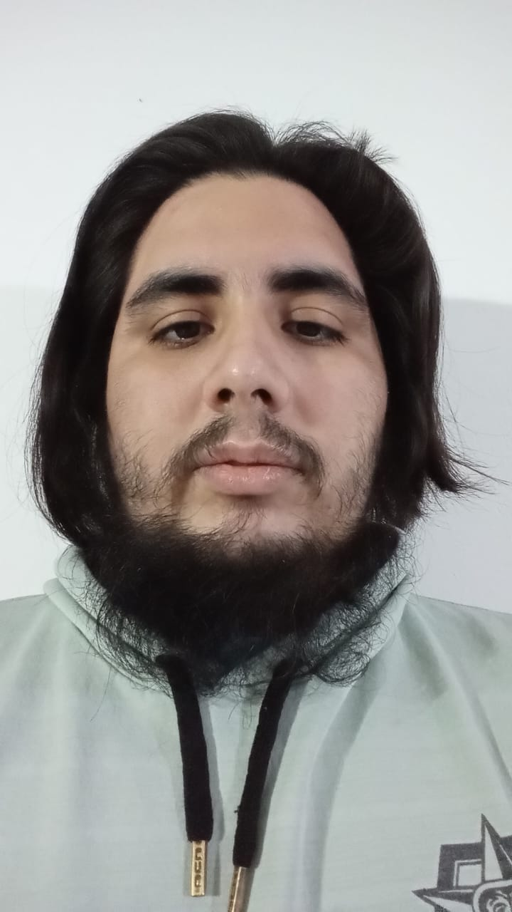

.

# Matías Nahuel Santos

Hola, me llamo **Nahuel**, tengo **25 años**. Estoy en la **Tecnicatura universitaria en programación de videojuegos** y este es mi cuarto cuatrimestre en ella. En 2017 cursé **Diseño de Animación 2D y 3D** hasta el 2021 que vino la pandemia, donde terminé de cursar con problemas.
Me inscribí en la tecnicatura de videojuegos en 2023 ya que un familiar ya venía cursando en la UNAHUR y me comento acerca de esta nueva propuesta de carrera, me pareció que se apegaba a mis planes a futuro y por eso le di la posibilidad al proyecto de carrera.
Pienso seguir aprendiendo programación para conseguir un trabajo algún día, además de que ya venía aprendiendo inglés para facilitar los trabajos en el extranjero, ya que uno de mis objetivos es viajar por el mundo.
Siempre me gusto la computación aunque nunca había indagado muy profundo, los primeros días en cada materia siempre me siento perdido, ya que en la secundaria hice bachillerato en administración, por lo tanto me cuesta un poco agarrarle la mano pero me encanta cuando comienzo a entender que estoy haciendo y que causa eso. Me encanta pensar cada ejercicio como un acertijo, y usar la creatividad para resolverlo y que me corrijan para bien y para mal mostrándome formas más rápidas y eficientes de soluciones a ellos.

# Mis gustos

- Me agrada dibujar en 2D y 3D, aunque requiera mucho tiempo en hacer cosas muy detalladas.
- Me gustan mucho los videojuegos, dormir y creo que tengo una leve adicción al café (es chiste).
- Me encanta el anime, los mangas, las novelas ligeras, novelas normales, también leo mucho manhwa y novelas coreanas.

**Gacias por leer.**
